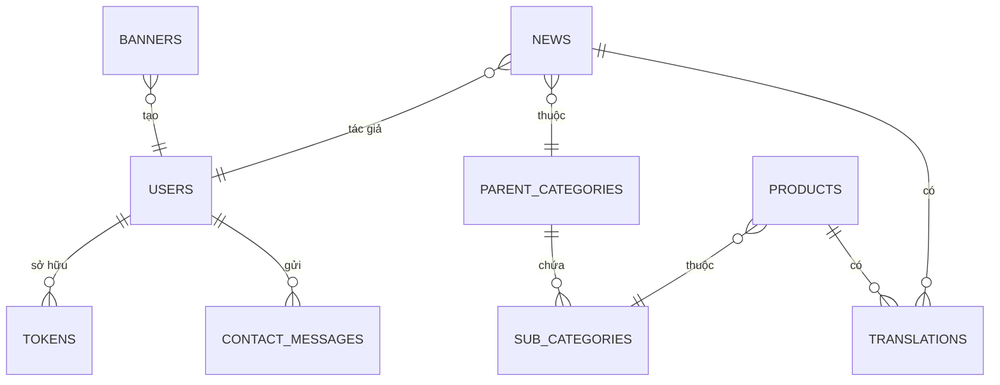

# AllXone System Design

## Kiến trúc tổng thể
Ứng dụng gồm ba lớp chính:

```mermaid
graph TD
  A[Trình duyệt người dùng]
  B[Cloudflare Workers (Hono API)]
  C[D1 Database]
  D[R2 Storage]
  E[Resend Email API]
  F[Google Analytics 4]

  A -->|HTTP| B
  B -->|SQL| C
  B -->|Upload/Download| D
  B -->|SMTP| E
  A -->|Measurement| F
```

- **Client**: React 19 + Vite, dựng UI và gọi API qua `VITE_API_BASE_URL`.
- **API**: Hono chạy trên Cloudflare Workers, xử lý routes trong thư mục `api/` và `functions/`.
- **CSDL**: D1 lưu trữ bảng `news`, `products`, `categories`, `contact_messages`, `translations`, ...
- **Storage**: R2 lưu hình ảnh; hỗ trợ watermark và tải lên từ trình soạn thảo.

## Luồng dữ liệu
1. Người dùng gửi yêu cầu qua trình duyệt.
2. Worker nhận yêu cầu, xác thực nếu cần và truy vấn D1 hoặc R2.
3. Worker trả dữ liệu JSON hoặc HTML cho trình duyệt.
4. Sự kiện trang được gửi tới GA4 để phân tích.

## Mô-đun chính
- **News & Products**: CRUD các bài viết và sản phẩm, phân loại theo `parent_categories` và `sub_categories`.
- **Auth**: đăng nhập, tạo token và bảo vệ các route quản trị.
- **Contact**: ghi nhận thông tin từ form và gửi email qua Resend.
- **Upload & Watermark**: upload hình ảnh và đóng watermark trước khi lưu vào R2.
- **SEO & Sitemap**: sinh `sitemap.xml`, `robots.txt` và metadata SEO.
- **Translations**: lưu chuỗi đa ngôn ngữ trong bảng `translations`.

## Sơ đồ cơ sở dữ liệu


## Triển khai
- **Development**: chạy `npm run dev` để start Vite cùng Worker local.
- **Testing**: lint với `npm run lint`.
- **Deploy**: dùng `wrangler deploy` hoặc GitHub Actions theo hướng dẫn trong README.

